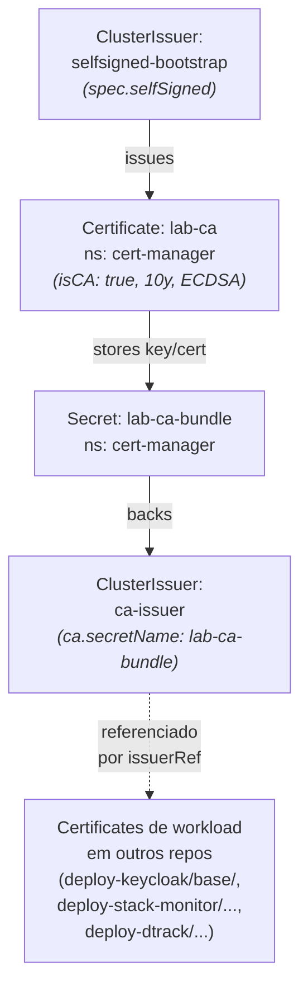

# Architecture — deploy-cert-manager

## Overview

PKI interna do cluster k3s. Substitui `bootstrap-tls.sh` (manual,
`openssl req` + `kubectl create secret tls`) por ciclo de vida
gerenciado: emissao, rotacao, distribuicao via cert-manager.

Stack:
- **cert-manager** controller — Helm chart upstream, instalado por
  Application separada em `deploy-argocd`.
- **Este repo** — `ClusterIssuer`s + a `Certificate` que gera o CA
  interno. **PKI cluster-wide apenas.**

`Certificate`s de workload vivem no repo do workload (deploy-keycloak,
deploy-stack-monitor, etc.) — referenciam `ca-issuer` (ClusterIssuer,
cluster-scoped) por nome.

Pra "como adicionar TLS pra um workload" e comandos operacionais, ver
[README.md](README.md).

---

## Topologia de confianca

Argo aplica os recursos deste repo de uma vez; cert-manager resolve
ordem internamente (selfsigned-bootstrap → lab-ca → ca-issuer →
workload certs em paralelo conforme aparecem).

---

## Decisoes de design

### Workload Certificates vivem no repo do workload

**Escolha:** este repo so contem PKI cluster-wide. Cada workload
declara seu proprio `Certificate` no proprio repo (deploy-keycloak,
deploy-stack-monitor, etc.), referenciando `ca-issuer` por nome.

**Alternativa:** centralizar todos os Certificates aqui em
`certificates/`, organizados por namespace.

**Por que:** centralizar transforma este repo em "yellow pages" de
todo workload que precisa de TLS. Toda vez que sobe um servico
novo, edita este repo em vez do repo do servico — o mesmo acoplamento
de monorepo que GitOps por repo busca evitar.

Com workload Certificates no repo do workload:
- **Ownership por repo:** quem deploya o servico tambem deploya o
  cert. Sem coordenacao cross-repo.
- **Lifecycle acompanha o workload:** deletar o repo (ou desativar
  Application) leva o cert junto.
- **Blast radius do PR:** mudar dnsNames de um servico nao toca este
  repo.

**Custo:** `ca-issuer` vira "API publica" deste repo — qualquer
mudanca no nome quebra todos os workloads que referenciam. Aceitavel
(nomes de ClusterIssuer mudam raro).

### Internal CA (`ca-issuer`) em vez de ACME staging

**Escolha:** ClusterIssuer `ca-issuer` lastreado por um CA self-signed
de 10 anos gerado pelo proprio cert-manager.

**Alternativa:** ACME Let's Encrypt staging (`acme: server: ...`).

**Por que:** ACME exige challenge HTTP-01 ou DNS-01 contra um nome
publicamente resolvivel. WSL homelab nao tem DNS publico — hosts de
teste sao `*.local` resolvido via `/etc/hosts`. HTTP-01 falha sem
rota publica, DNS-01 sem registrar publico. CA interno nao tem essa
dependencia e mimetiza o pattern real de PKI corporativa (AWS Private
CA, Vault PKI, ADCS).

**Custo:** browsers/clientes externos veem cert como untrusted ate
importarem o `lab-ca.crt` no trust store. Aceitavel pro lab.

### `selfsigned-bootstrap` + `ca-issuer` em vez de `selfSigned` direto

**Escolha:** dois ClusterIssuers em cadeia — `selfsigned-bootstrap`
so existe pra assinar o CA cert (`lab-ca`), e `ca-issuer` (baseado
em `ca.secretName: lab-ca-bundle`) emite todos os certs de workload.

**Alternativa:** unico ClusterIssuer `selfSigned: {}` direto, com
cada Certificate gerando seu proprio cert independente.

**Por que:** com `selfSigned` direto, cada workload tem um cert
ancorado em si mesmo — nao ha cadeia de confianca compartilhada.
Importar N CA certs no trust store (1 por workload) e impraticavel.
Com CA intermediario unico, importa 1 cert (`lab-ca`) e todo o
cluster passa a ser confiavel. Tambem reflete o pattern real
("organization CA emite N certs de servico").

**Custo:** 1 step a mais de bootstrap (gerar CA cert) — invisivel pro
operador depois.

### ECDSA P-256 em vez de RSA 4096

**Escolha:** `privateKey.algorithm: ECDSA, size: 256` no CA e
recomendado pros workloads.

**Alternativa:** RSA 4096 (default historico de muitos templates).

**Por que:** payload menor (TLS handshake ~3x mais rapido), compute
menor pra assinar/verificar. Browsers/clientes modernos suportam
universalmente. Sem motivo pra RSA hoje exceto compatibilidade com
sistemas antigos.

**Custo:** dispositivos pre-2015 podem nao suportar ECDSA. Irrelevante
pra lab; em prod, audit do client base antes.

### `rotationPolicy: Always`

**Escolha:** toda renovacao de cert gera chave privada nova tambem.

**Alternativa:** `rotationPolicy: Never` (default) — renova cert
mantendo a mesma chave.

**Por que:** rotacao de chave a cada renovacao limita o risco de
chave comprometida silenciosamente. Custo de compute desprezivel
com ECDSA. Pratica recomendada pelo proprio cert-manager.

**Custo:** processos que cacheiam chave precisam reload no ciclo de
renovacao (15 dias). Ingresses via Traefik/nginx-controller fazem
isso automaticamente.

---

## Limitacoes conhecidas

### Hoje, dentro do escopo atual

- **CA cert nao distribuido automaticamente.** Pra browsers/clients
  fora do cluster aceitarem certs sem warning, o usuario precisa
  extrair `lab-ca-bundle` e importar manualmente no trust store
  (Linux: `update-ca-certificates`; Windows: certmgr.msc). Sem
  trust-manager, esse passo e manual.
- **Sem alert pra cert proximo de expirar.** cert-manager renova
  automaticamente em `renewBefore` (15 dias), mas se reconciliacao
  falhar (Issuer NotReady, quota, etc.), nao ha alerta gerado. Em
  prod, PrometheusRule monitorando
  `certmanager_certificate_expiration_timestamp_seconds` seria
  obrigatorio. Backlog.

### Se a stack mudar, viram limitacao

- **Migracao pra AWS PCA / Vault PKI.** Substitui `ca-issuer` por
  `AWSPCAClusterIssuer` ou `VaultClusterIssuer`. Workload Certificates
  permanecem identicos (so muda `issuerRef`). Variante AWS comentada
  no `issuers/lab-ca-certificate.yaml`.
- **DNS publico + ACME.** Adicionar `letsencrypt-prod` ClusterIssuer
  com solver HTTP-01 (precisa ingress publico) ou DNS-01 (precisa
  account no provedor DNS). Workload Certificates trocam `issuerRef`
  pro novo issuer; tudo mais permanece.
- **trust-manager pra distribuir CA bundle.** Substitui o passo
  manual de importar `lab-ca.crt`. trust-manager (sibling do
  cert-manager) usa CR `Bundle` pra propagar CA bundle pra ConfigMaps
  em todos os namespaces e/ou trust store de nodes.
